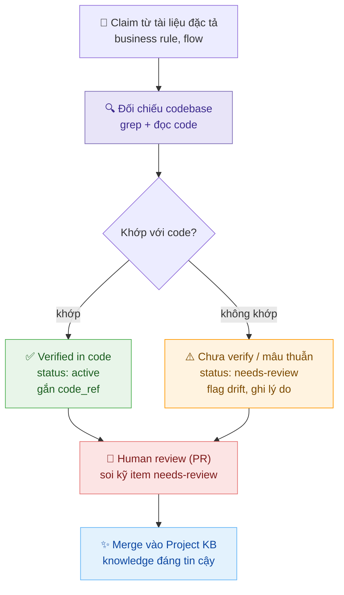

# Stock Knowledge Hub — AI Agent cho Sản phẩm Chứng Khoán Zalopay

> **Không chỉ là tìm kiếm tài liệu — đây là tri thức nghiệp vụ đã được chưng cất và đối chiếu với codebase thực tế.**

---

## Vấn đề thực sự

Hãy tưởng tượng bạn là kỹ sư mới join team TKCK (Tài Khoản Chứng Khoán trên Zalopay).

Ngày đầu tiên, bạn được giao task liên quan đến flow nạp tiền. Bạn không biết:
- Hệ thống có bao nhiêu service liên quan? Service nào làm gì?
- Business rule nào chi phối flow này? Có edge case nào đặc biệt không?
- File nào trong repo xử lý validation? Đọc file nào trước?
- Tài liệu đặc tả nằm ở đâu? Cái nào còn hiệu lực, cái nào đã cũ?

Bạn mất 2–3 ngày hỏi người này người kia, mở hàng chục file, đọc hàng chục tài liệu trên Confluence — và vẫn không chắc mình hiểu đúng.

**Đây là vấn đề của mọi người mới onboarding vào một sản phẩm tài chính phức tạp.**

---

## Stock Knowledge Hub giải quyết điều này như thế nào?

Chúng tôi không chỉ đơn thuần index tài liệu. Điểm khác biệt cốt lõi là:

### Tri thức được chưng cất, không phải copy-paste

Từ hàng trăm trang đặc tả tính năng (PRD), chúng tôi trích xuất ra một **Project Knowledge Base (KB)** — một lớp tri thức trung gian chứa đúng những gì code không thể tự diễn đạt:
- **Business rule** với nguồn gốc rõ ràng (`[PRD: tên-file]`, `[code: path:line]`)
- **Flow map mức cao** qua các service — ai gọi ai, theo thứ tự nào
- **Thuật ngữ nghiệp vụ** (glossary) mapping khái niệm business ↔ tên trong code
- **ADR / Design rationale** — tại sao team chọn phương án này, không phải phương án kia
- **Known risks** — những điểm nhạy cảm về tiền, settlement, compliance

### Tri thức được đối chiếu với codebase thực

Mỗi business rule trong KB đều có `code_refs` trỏ đến file và dòng code cụ thể đã được verify. Khi hỏi "luồng nạp tiền hoạt động thế nào?", agent không chỉ giải thích luồng mà còn có thể nói "validation xảy ra ở `funding-service/handler/deposit.go:142`".

Điều này có nghĩa là:
- **Người mới** biết ngay đọc file nào, dòng nào
- **Engineer** debug nhanh hơn vì hiểu intent của business rule
- **PM/BA** tra cứu được trạng thái thực tế của feature, không phải tài liệu cũ

---

## Ai dùng được gì?

| Vai trò | Câu hỏi điển hình | Agent trả lời được vì... |
|---|---|---|
| **Kỹ sư mới onboarding** | "Giải thích toàn bộ flow đặt lệnh cho tôi" / "Service nào tôi cần đọc code trước?" | KB có flow map + code_refs đã verified |
| **Software Engineer** | "File nào xử lý logic withdrawal validation?" / "Business rule nào ảnh hưởng đến matching?" | code_refs trong KB trỏ thẳng đến file:line |
| **Product Manager / BA** | "Acceptance criteria của MP order là gì?" / "Feature margin trading cover edge case nào?" | 140+ đặc tả được index với metadata đầy đủ |
| **QA / Tester** | "Điều kiện để lệnh bị reject?" / "Onboarding flow có những happy path nào?" | Business rules + flows được structured |
| **Tech Lead** | "Tại sao team chọn kiến trúc này?" / "Có design decision nào liên quan đến settlement không?" | ADR và design rationale được lưu trong KB |

---

## Kiến trúc

```
Người dùng (Web UI / API)
        │
        ▼
  [LangGraph ReAct Agent]  ←── System Prompt (TKCK context)
        │
        ├── search_prd          → 140+ đặc tả tính năng (FTS5, BM25 ranking)
        ├── search_requirements → Acceptance criteria cụ thể
        ├── get_prd_detail      → Toàn văn một tài liệu
        ├── list_features       → Liệt kê theo domain/sub-area
        ├── search_kb           → Knowledge Base đã chưng cất
        ├── get_kb_detail       → Business rules, flows, ADR chi tiết
        └── find_code_refs      → File source code đã verified
                │
                ▼
        [SQLite FTS5]
         ├── prd_nodes    — 140+ feature specs (index từ INDEX.yaml)
         ├── kb_nodes     — Business rules / flows / glossary / ADR / risks
         └── code_refs    — File:line references đã đối chiếu với codebase
```

**Response cache** (SQLite, TTL 7 ngày) — câu hỏi lặp lại trả về ngay với streaming effect giống thật.

---

## Quy trình đảm bảo chất lượng Knowledge Base

Điểm khác biệt quan trọng: mỗi claim từ tài liệu đặc tả đều phải qua bước đối chiếu với codebase trước khi được chấp nhận vào KB.



---

## Pipeline xây dựng Knowledge Base

Đây là phần phân biệt hệ thống với việc "chỉ index tài liệu":

```
PRD documents (140+ files)
        │
        ▼  [Bước 1 — Index mode]
  INDEX.yaml (sub_area, type, use_when, topics, status)
        │
        ▼  [Bước 2 — Knowledge extraction]
  Project KB (project-kb/domains/stock/)
  ├── business-rules.md  — rules + provenance
  ├── flows/*.md         — cross-service flow maps
  ├── glossary.md        — business ↔ code term mapping
  ├── adr.md             — design decisions + rationale
  └── risks.md           — known risks, compliance notes
        │
        ▼  [Bước 3 — Code verification]
  code_refs verified against actual repo
  (status: active | needs-review | deprecated)
        │
        ▼
  knowledge.db (SQLite FTS5)
  → Agent có thể tra cứu với độ chính xác cao
```

---

## Tech Stack

| Thành phần | Công nghệ |
|---|---|
| Agent Framework | LangGraph (ReAct) + LangChain |
| LLM | OpenAI-compatible (GreenNode AIP / OpenAI) |
| Database | SQLite FTS5 (BM25 full-text ranking) |
| Backend | Python, Starlette, Server-Sent Events |
| Frontend | Vanilla JS, dark UI, marked.js, localStorage |
| Platform | GreenNode AgentBase (VNG Cloud) |

---

## Cài đặt & Chạy thử

```bash
git clone https://github.com/mainhatnam219/zlp-clawathon-agent.git
cd zlp-clawathon-agent
cp .env.example .env
# Điền GREENNODE_CLIENT_ID, GREENNODE_CLIENT_SECRET, LLM_API_KEY, LLM_BASE_URL, LLM_MODEL

# Nạp dữ liệu (PRD + KB)
python ingest.py

# Chạy local
pip install -r requirements.txt
python main.py
# → http://localhost:8080
```

---

## Ví dụ câu hỏi

```
"Mình mới join team, luồng nạp tiền hoạt động thế nào từ đầu đến cuối?"
"Business rule nào ảnh hưởng đến việc khớp lệnh MP?"
"File nào xử lý deposit validation? Dòng mấy?"
"Tại sao team thiết kế flow onboarding theo hướng này?"
"Margin call được trigger khi nào? Có known risk gì không?"
"Domain ví có những tính năng nào đã đặc tả?"
```

---

*Built for Zalopay Clawathon · Powered by GreenNode AgentBase · LangGraph ReAct Agent*
