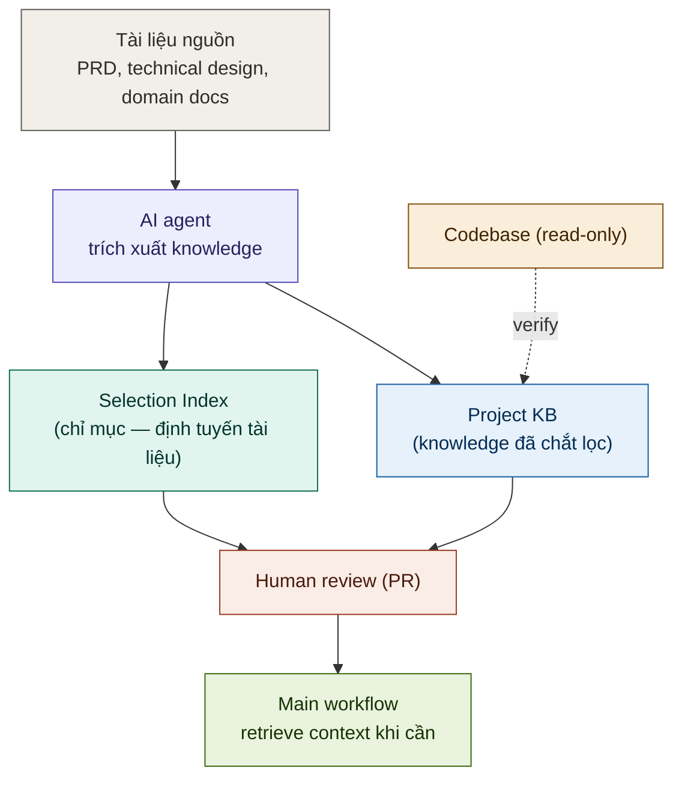
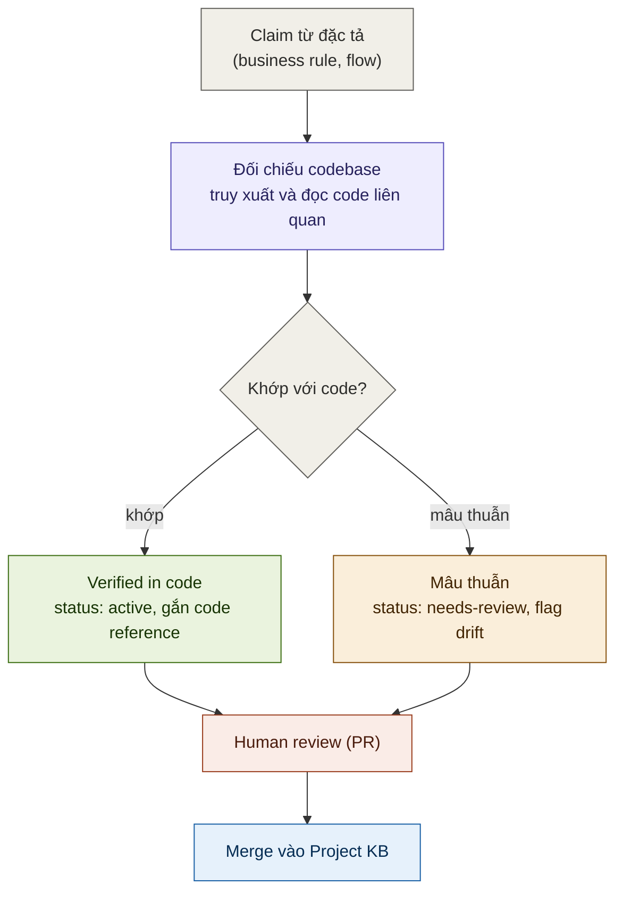

# Stock Knowledge Hub — AI Agent cho Sản phẩm Chứng Khoán Zalopay

> **Không chỉ là tìm kiếm tài liệu — đây là tri thức nghiệp vụ đã được chưng cất và đối chiếu với codebase thực tế.**

---

## Vấn đề thực sự

Hãy tưởng tượng bạn là kỹ sư mới join team TKCK (Tài Khoản Chứng Khoán trên Zalopay).

Ngày đầu tiên, bạn được giao task liên quan đến flow nạp tiền. Bạn không biết:
- Hệ thống có bao nhiêu service liên quan? Service nào làm gì?
- Business rule nào chi phối flow này? Có edge case nào đặc biệt không?
- File nào trong repo xử lý validation? Đọc file nào trước?
- Tài liệu đặc tả nằm ở đâu? Cái nào còn hiệu lực, cái nào đã cũ?

Bạn mất 2–3 ngày hỏi người này người kia, mở hàng chục file, đọc hàng chục tài liệu trên Confluence — và vẫn không chắc mình hiểu đúng.

**Đây là vấn đề của mọi người mới onboarding vào một sản phẩm tài chính phức tạp.**

---

## Stock Knowledge Hub giải quyết điều này như thế nào?

Chúng tôi không chỉ đơn thuần index tài liệu. Điểm khác biệt cốt lõi là:

### Tri thức được chưng cất, không phải copy-paste

Từ hàng trăm trang đặc tả tính năng (PRD), chúng tôi trích xuất ra một **Project Knowledge Base (KB)** — một lớp tri thức trung gian chứa đúng những gì code không thể tự diễn đạt:
- **Business rule** với nguồn gốc rõ ràng (`[PRD: tên-file]`, `[code: path:line]`)
- **Flow map mức cao** qua các service — ai gọi ai, theo thứ tự nào
- **Thuật ngữ nghiệp vụ** (glossary) mapping khái niệm business ↔ tên trong code
- **ADR / Design rationale** — tại sao team chọn phương án này, không phải phương án kia
- **Known risks** — những điểm nhạy cảm về tiền, settlement, compliance

### Tri thức được đối chiếu với codebase thực

Mỗi business rule trong KB đều có `code_refs` trỏ đến file và dòng code cụ thể đã được verify. Khi hỏi "luồng nạp tiền hoạt động thế nào?", agent không chỉ giải thích luồng mà còn có thể nói "validation xảy ra ở `funding-service/handler/deposit.go:142`".

Điều này có nghĩa là:
- **Người mới** biết ngay đọc file nào, dòng nào
- **Engineer** debug nhanh hơn vì hiểu intent của business rule
- **PM/BA** tra cứu được trạng thái thực tế của feature, không phải tài liệu cũ

---

## Ai dùng được gì?

| Vai trò | Câu hỏi điển hình | Agent trả lời được vì... |
|---|---|---|
| **Kỹ sư mới onboarding** | "Giải thích toàn bộ flow đặt lệnh cho tôi" / "Service nào tôi cần đọc code trước?" | KB có flow map + code_refs đã verified |
| **Software Engineer** | "File nào xử lý logic withdrawal validation?" / "Business rule nào ảnh hưởng đến matching?" | code_refs trong KB trỏ thẳng đến file:line |
| **Product Manager / BA** | "Acceptance criteria của MP order là gì?" / "Feature margin trading cover edge case nào?" | 140+ đặc tả được index với metadata đầy đủ |
| **QA / Tester** | "Điều kiện để lệnh bị reject?" / "Onboarding flow có những happy path nào?" | Business rules + flows được structured |
| **Tech Lead** | "Tại sao team chọn kiến trúc này?" / "Có design decision nào liên quan đến settlement không?" | ADR và design rationale được lưu trong KB |

---

## Kiến trúc

```
Người dùng (Web UI / API)
        │
        ▼
  [LangGraph ReAct Agent]  ←── System Prompt (TKCK context)
        │
        ├── search_prd          → 140+ đặc tả tính năng (FTS5, BM25 ranking)
        ├── search_requirements → Acceptance criteria cụ thể
        ├── get_prd_detail      → Toàn văn một tài liệu
        ├── list_features       → Liệt kê theo domain/sub-area
        ├── search_kb           → Knowledge Base đã chưng cất
        ├── get_kb_detail       → Business rules, flows, ADR chi tiết
        └── find_code_refs      → File source code đã verified
                │
                ▼
        [SQLite FTS5]
         ├── prd_nodes    — 140+ feature specs (index từ INDEX.yaml)
         ├── kb_nodes     — Business rules / flows / glossary / ADR / risks
         └── code_refs    — File:line references đã đối chiếu với codebase
```

**Response cache** (SQLite, TTL 7 ngày) — câu hỏi lặp lại trả về ngay với streaming effect giống thật.


---

## Quy trình xây dựng Knowledge Base

Project KB được khởi tạo bằng một AI agent thực hiện việc trích xuất knowledge từ các nguồn tài liệu của dự án — PRD, technical design, tài liệu domain — và đối chiếu với codebase để xác định những thông tin đáng được lưu giữ. Kết quả của quá trình này không phải một kho dữ liệu khép kín, mà là tập hợp các file markdown được đề xuất thông qua Pull Request và phải qua review của con người trước khi được hợp nhất. Cơ chế này hiện thực hóa nguyên tắc docs-as-code: knowledge được quản lý version, gắn ownership, trải qua quy trình phê duyệt — tương đồng với cách team vận hành source code.



Quá trình tạo ra hai sản phẩm song song, phục vụ hai mục đích khác biệt. Selection Index là một chỉ mục gọn nhẹ, trỏ ngược về tài liệu nguồn, giúp xác định tài liệu cần truy xuất khi yêu cầu thông tin chi tiết. Project KB là lớp knowledge đã được chắt lọc và đối chiếu với code — có độ tin cậy cao hơn khi sử dụng làm context, đổi lại đòi hỏi nỗ lực review lớn hơn. Cả hai đều không được đưa trực tiếp vào workflow mà phải qua human review; con người thẩm định, hiệu chỉnh, rồi mới hợp nhất, đảm bảo nội dung trong KB phản ánh hiểu biết đã được xác nhận thay vì suy luận chưa kiểm chứng của agent.

## Cơ chế kiểm chứng đặc tả đối chiếu với codebase

Thách thức trọng yếu khi xây dựng KB không nằm ở việc tạo ra tài liệu, mà ở việc xác định mức độ tin cậy của từng knowledge item. Tài liệu đặc tả có thể đã lỗi thời, hoặc mô tả ý định thiết kế ban đầu khác với những gì thực sự được triển khai. Do đó, mỗi claim trích xuất từ đặc tả — một business rule hay một bước trong flow — đều được đối chiếu với codebase. Việc đối chiếu này được tổ chức thành một quality gate có phân nhánh, không phải một bước xác nhận tuyến tính.



Nguyên tắc cốt lõi: một claim mâu thuẫn với code hoặc không thể xác minh sẽ không bị loại bỏ, mà được giữ lại với status `needs-review`, kèm theo cờ đánh dấu drift và lý do cụ thể, rồi chuyển cho con người xử lý. Cơ sở của cách làm này là một mismatch có thể bắt nguồn từ đặc tả sai hoặc lỗi thời, nhưng cũng có thể phản ánh việc code đã drift khỏi spec. Agent không có thẩm quyền phán quyết bên nào là nguồn chính xác, nên vai trò của nó dừng lại ở mức phát hiện và đánh dấu; quyết định cuối cùng thuộc về con người. Nhờ vậy, human review có thể tập trung vào đúng các item `needs-review` thay vì phải rà soát toàn bộ KB.

Bên cạnh hai nhánh trên còn tồn tại một loại claim mà code không thể xác nhận lẫn phủ định — các business rule thuần túy như giới hạn theo cấp KYC hoặc điều kiện nghiệp vụ không được thể hiện trong code. Những item này mặc định cũng được đặt ở trạng thái `needs-review`, chờ Product hoặc owner xác nhận, thay vì tự động gắn `active`.

---

## Tech Stack

| Thành phần | Công nghệ |
|---|---|
| Agent Framework | LangGraph (ReAct) + LangChain |
| LLM | OpenAI-compatible (GreenNode AIP / OpenAI) |
| Database | SQLite FTS5 (BM25 full-text ranking) |
| Backend | Python, Starlette, Server-Sent Events |
| Frontend | Vanilla JS, dark UI, marked.js, localStorage |
| Platform | GreenNode AgentBase (VNG Cloud) |

---

## Cài đặt & Chạy thử

```bash
git clone https://github.com/mainhatnam219/zlp-clawathon-agent.git
cd zlp-clawathon-agent
cp .env.example .env
# Điền GREENNODE_CLIENT_ID, GREENNODE_CLIENT_SECRET, LLM_API_KEY, LLM_BASE_URL, LLM_MODEL

# Nạp dữ liệu (PRD + KB)
python ingest.py

# Chạy local
pip install -r requirements.txt
python main.py
# → http://localhost:8080
```

---

## Ví dụ câu hỏi

```
"Mình mới join team, luồng nạp tiền hoạt động thế nào từ đầu đến cuối?"
"Business rule nào ảnh hưởng đến việc khớp lệnh MP?"
"File nào xử lý deposit validation? Dòng mấy?"
"Tại sao team thiết kế flow onboarding theo hướng này?"
"Margin call được trigger khi nào? Có known risk gì không?"
"Domain ví có những tính năng nào đã đặc tả?"
```

---

*Built for Zalopay Clawathon · Powered by GreenNode AgentBase · LangGraph ReAct Agent*
